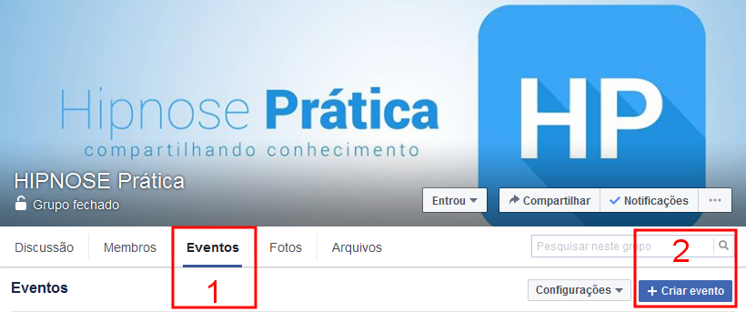
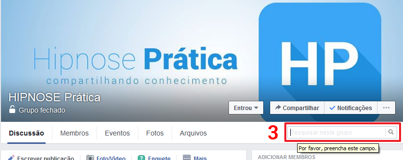
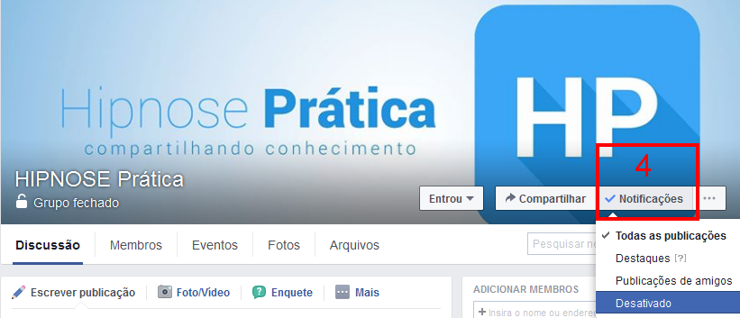

<!-- ---
title:      Regras do Grupo Hipnose Prática    
author:     Samej Spenser  
date:       June 17, 2012  
update:     December 30, 2017  
abstract:   Descrição, Regras e Instruções para a boa convivência do/no grupo Hipnose Prática.  
tags:       [Dica, Dicas, Facebook, Grupo, Hipnose Prática, Hipnose, Prática, Regra, Regras, Samej Spenser, Samej, Spenser, Telegram,]  
link:       http://telegra.ph/TITULO-mm-dd  
link:       https://github.com/SamejSpenser/HipnosePratica  
lang:       pt-BR  
--- -->

<!-- LINK EXTERNO PARA O CSS -->

<link type="text/css" rel="stylesheet" href="./stylesheets/stylesheet.css" />

<link href="https://fonts.googleapis.com/css?family=Architects%20Daughter" rel="stylesheet">

<!-- REGRAS DO GRUPO HIPNOSE PRÁTICA ~ PUBLICADO EM 2012/06/17 ~ ATUALIZADO EM 2017/12/30 -->

<!-- IMAGEM CENTRALIZADA -->

    <figure>
        
    </figure>

<!-- 

![LOGOTIPO DO GRUPO HIPNOSE PRÁTICA: “Hipnose Prática, compartilhando conhecimento”][logotipohpIMG001]

[logotipohpIMG001]: images/logo-hp-landscape-3892x1440px.png -->

&nbsp;

# Regras do Grupo Hipnose Prática

&nbsp;

## TÓPICOS

&nbsp;

<!-- MarkdownTOC depth=4 autolink=true bracket=round autoanchor=true style=unordered -->

- [INTRODUÇÃO](#introdu%C3%87%C3%83o)
    - [Importante](#importante)
    - [Sobre o grupo](#sobre-o-grupo)
    - [Explicando o motivo das regras](#explicando-o-motivo-das-regras)
- [SEÇÃO I](#se%C3%87%C3%83o-i)
    - [Publicidade em geral](#publicidade-em-geral)
- [SEÇÃO II](#se%C3%87%C3%83o-ii)
    - [Perfil falso \(fake\)](#perfil-falso-fake)
- [SEÇÃO III](#se%C3%87%C3%83o-iii)
    - [Atenha-se aos assuntos do grupo](#atenha-se-aos-assuntos-do-grupo)
- [SEÇÃO IV](#se%C3%87%C3%83o-iv)
    - [Postagem e comentário](#postagem-e-coment%C3%A1rio)
- [SEÇÃO V](#se%C3%87%C3%83o-v)
    - [Postagem humorística](#postagem-humor%C3%ADstica)
- [SEÇÃO VI](#se%C3%87%C3%83o-vi)
    - [Ofensas](#ofensas)
- [SEÇÃO VII](#se%C3%87%C3%83o-vii)
    - [Crítica\(s\)](#cr%C3%ADticas)
- [SEÇÃO VIII](#se%C3%87%C3%83o-viii)
    - [Adicionando amigo\(s\) ao grupo](#adicionando-amigos-ao-grupo)
- [SEÇÃO IX](#se%C3%87%C3%83o-ix)
    - [Bate-papo](#bate-papo)
- [ADMINISTRADOR E MODERADORES DO GRUPO](#administrador-e-moderadores-do-grupo)
    - [Administrador](#administrador)
    - [Moderadores](#moderadores)
- [DICAS](#dicas)
- [OBSERVAÇÕES](#observa%C3%87%C3%95es)
- [NOTAS](#notas)

<!-- /MarkdownTOC -->

<!-- SEPARADOR -->

&nbsp;

&nbsp;

## INTRODUÇÃO

&nbsp;

Grupo de estudiosos e profissionais que se interessam pela Hipnose.

**Descrição, Regras e Instruções para a boa convivência do/no grupo Hipnose Prática.**

&nbsp;

### Importante

Lembre-se de, ao ser aceito, conferir as **DUAS PUBLICAÇÕES FIXADAS** no topo do mural do grupo, e os comentários dos mesmos. Ali você encontra informações importantíssimas sobre o comportamento do grupo, indicação de livros indispensáveis ~~(para iniciantes)~~, links permanentes para publicações antigas no mural que são relevantes e muito mais.

<!-- [1] NOTA DE FIM -->

Ao solicitar participação no grupo Hipnose Prática, seu perfil será pré-avaliado por um dos [administradores][16]. O que buscamos são pessoas “de verdade”, logo, se o seu perfil não tiver e/ou não exibir um mínimo de informação sobre você, esse perfil será considerado “fake”[1](#ftn1) e a solicitação será rejeitada (conforme o [*§* 3 da Seção II](#II3)).

É de bom tom que sua localização (cidade, estado/província) seja exibida, um resumo sobre você mesmo e de preferência, profissão e escolaridade (independente de quais sejam).

As publicações no mural do grupo são moderadas previamente, ou seja, é necessário que um dos administradores do grupo aprove sua publicação. Até que isso aconteça, a mesma não será visível no mural.

Caso o administrador compreenda que a publicação não corresponda e/ou não respeita as regras abaixo, a publicação será rejeitada.

Publicações diversas em forma de comentário em qualquer outra publicação não será tolerada, logo, se isso acontecer, corre-se o risco de ser banido do grupo.

&nbsp;

### Sobre o grupo

A finalidade deste grupo é a disseminação do conhecimento da Hipnose ao público, — entenda-se *“interessado(s)”* —, respeitando opiniões e posições diferentes, para o crescimento do todo, sem exclusivismo(s) e/ou estrelismo(s) de qualquer ordem.

&nbsp;

> Lembre(m)-se: “O mapa não é o território!”

&nbsp;

### Explicando o motivo das regras

Membro(s) do grupo Hipnose Prática, (e interessados em aderir ao grupo), estas são as ~~(novas)~~ regras que passam a vigorar a partir da data de sua publicação, (17/06/2012, atualizadas dia 18/09/2016).

Devido a “mal-entendidos” ocorridos anteriormente, eu, [Samej Spenser][17], na função de administrador deste grupo, (pura e simplesmente por ter criado o grupo a partir do meu perfil), me vi obrigado a suspender temporariamente novas publicações no grupo numa “tentativa” de conter novos “desentendimentos”. Pensei bastante sobre o que fazer para “amenizar” a situação ~~e confesso que quase deletei o grupo~~. Depois de conversar com algumas pessoas, e de receber o feedback de alguns membros por mensagens inbox, optei por incluir (mais) moderadores para me auxiliarem no “controle” e “manutenção” do grupo.

Juntos, estes moderadores e eu estudamos “novas regras de conduta” para a boa convivência e interação dos membros **DO** e **NO** grupo.

**Leiam atentamente… releiam, leiam novamente e sigam as ~~novas~~ regras para todos desfrutarmos dos benefícios que nossa interação proporciona.**

Conto com a compreensão e colaboração de todos.

Atenciosamente,  
**Samej Spenser**

<!-- SEPARADOR -->

&nbsp;

&nbsp;

## SEÇÃO I

&nbsp;

<!-- IMAGEM CENTRALIZADA -->

    <figure>
        
        <figcaption><small>Menu <code>Eventos</code> [1] e botão <code>+ Criar evento</code> [2].</small></figcaption>
    </figure>

<!-- 

![SCREENSHOT: menu eventos e botão para criar novo evento.][eventosIMG001]  
<small>Menu `Eventos` \[1\] e botão `+ Criar evento` \[2\].</small>

[eventosIMG001]: images/regras-hp-001.png -->

<!-- SEPARADOR -->

&nbsp;

&nbsp;

### Publicidade em geral

1. Quer divulgar um curso, workshop, palestra ou qualquer outro evento relacionado à HIPNOSE e/ou temas correlatos? Então utilize o menu `Eventos` \[1\], — no menu horizontal, ao lado do título do grupo, clique em `Eventos` \[1\] e em seguida, clique no botão `+ Criar evento` \[2\];

2. Qualquer publicidade/propaganda (*direta* ou *indireta*, *proposital* ou *não proposital*) publicada fora do local específico será deletada **SEM PRÉVIO AVISO**, e seu autor poderá ser notificado aberta e publicamente por um dos moderadores. Em caso de reincidência, o autor será banido do grupo. Caso o autor solicite participar do grupo novamente e publicar alguma publicidade/propaganda em local indevido, será banido e bloqueado permanentemente;

3. Será permitido apenas um evento por anúncio. Desta forma, eventos repetidos serão deletados e seu autor notificado, valendo o mesmo que o [*§* 2 da Seção I](#I2);

4. Texto(s) “bonitinho(s)”, mensagem(ns) de “bom dia” e etc., que estiver(em) ocultando propaganda(s) será(ão) deletada(s) imediatamente, valendo o mesmo que o [*§* 2 da Seção I](#I2);

5. Caso possua um Blog/Site, Página no Facebook, Twitter, Fórum e etc., que fale/trate sobre [Auto-Hipnose][20],[2](#ftn2) [Hipnose][18], [PNL][19], Letargia, EFT, e outros temas relativos, (desde que tratados de forma “séria”), envie uma **MENSAGEM PRIVADA** (inbox) para um dos moderadores, para que este inclua o(s) respectivo(s) link(s) na planilha do grupo Hipnose Prática;  
    1. Esta planilha será ordenada alfabeticamente pelo nome do perfil do membro, (caso altere o nome no seu perfil, informe um dos moderadores para que a alteração na planilha seja efetuada);  
    2. O membro se compromete a fornecer o endereço (link) correto;  
    3. Esta planilha será disponibilizada através de um link de visualização no Google Drive. [Este link se encontra no final deste texto/documento][21] para a simples conferência de qualquer membro do grupo;  
    4. Apenas os moderadores terão acesso à edição desta planilha.

<!-- SEPARADOR -->

&nbsp;

&nbsp;

## SEÇÃO II

&nbsp;

### Perfil falso (fake)

<!-- [3] NOTA DE FIM -->

1. Perfil(is) que for(em) identificado(s) e/ou comprovado(s) como falso(s) ou “fake(s)”, serão banidos e bloqueados permanentemente e/ou terão sua solicitação de participação negada;  
    1. O mesmo vale para contas com menos de um ano no facebook, e/ou que esteja participando em mais de trinta grupos;[3](#ftn3)

2. Perfil(is) com o nome de empresa, negócio e etc., será(ão) recusado(s) e/ou removido(s) do grupo;[4](#ftn4)

3. Ao(s) interessado(s) em participar do grupo que não tiver(em) um “mínimo” de informação sobre si na descrição de seu(s) próprio(s) perfil(is), terá(ão) maior(es) chance(s) de ser(em) interpretado(s) como “fake(s)”.

<!-- SEPARADOR -->

&nbsp;

&nbsp;

## SEÇÃO III

&nbsp;

### Atenha-se aos assuntos do grupo

1. Está vetado o compartilhamento e/ou publicação de imagens “fofas”, vídeos engraçados, textos, imagens e/ou mensagens de cunho religioso ou mensagens avulsas, (excetuando casos onde estes possuam ligação com os assuntos do grupo);

2. Mensagem(ns) compartilhada(s) do perfil(is) de usuário(s) e/ou página(s) será(ão) recusados. Pois entende-se que essa prática é uma “isca” de curtidas e/ou *likes*, valendo o mesmo que o [*§* 2 da Seção I](#I2). Caso queira compartilhar algum texto, imagem, link, vídeo e etc., faça-o pelo mural do grupo;

<!-- SEPARADOR -->

&nbsp;

&nbsp;

## SEÇÃO IV

&nbsp;

<!-- IMAGEM CENTRALIZADA -->

    <figure>
        
        <figcaption><small>[3] Caixa de buscas e pesquisa no mural do grupo.</small></figcaption>
    </figure>

<!-- 

![SCREENSHOT: caixa de buscas do grupo.][buscaIMG001]  
<small>\[3\] Caixa de buscas e pesquisa no mural do grupo.</small>

[buscaIMG001]: images/regras-hp-002.png -->

<!-- SEPARADOR -->

&nbsp;

&nbsp;

### Postagem e coment��rio

1. Antes de publicar alguma postagem, procure nas postagens anteriores se o que você pretende postar já se encontra publicado;

2. Acostume-se a utilizar o campo de busca \[3\], (localizado no canto direito do menu horizontal), clique na lupa e digite o(s) termo(s) de sua pesquisa. Desta forma, você pode encontrar postagens, publicações e comentários que estão “distantes”, lá embaixo no ~~limbo do~~ mural;

3. Para “ressuscitar” uma postagem antiga, basta fazer qualquer comentário para que a mesma volte para o topo do/no mural;

4. Atente-se firmemente onde você fará seu(s) comentário(s), pois comentário(s) de uma postagem em outra, e/ou comentário(s) de uma postagem como nova postagem interrompem a fluidez do assunto em questão;

5. Comentário(s) fora do local adequado terá(ão) um prazo de 48 horas para ser(em) adicionado(s) no local correto. E um dos moderadores entrará em contato através de mensagem particular (inbox) para lhe(s) alertar. Após este tempo, será(ão) deletado(s);

6. Procure utilizar o idioma corretamente, (principalmente a pontuação), para que a compreensão do mesmo seja perfeita, fácil e agradável. (Na *[Publicação Hipnose Prática][22]* no Medium tem um artigo que se aplica muito bem neste caso: *“Comunicação Efetiva Através de E-mail”*, que pode ser conferido neste link: [https://medium.com/p/43f21ab97931][2]);

7. Caso não compreenda alguma palavra e/ou termo, (gíria(s), por exemplo), utilizado por algum membro de outra nacionalidade, procure ajuda com o tradutor do Google, ([https://translate.google.com][3]), ou pergunte para quem publicou se pode utilizar outras palavras para se expressar;

<!-- SEPARADOR -->

&nbsp;

&nbsp;

## SEÇÃO V

&nbsp;

### Postagem humorística

1. Postagem(ns) (pura e simplesmente) “humorística(s)” será(ão) deletada(s). Um comentário engraçado, uma “piada” leve (nos comentários e desde que seja relativa ao tema da postagem) será(ão) **“RELEVADA(S)”**;

<!-- SEPARADOR -->

&nbsp;

&nbsp;

## SEÇÃO VI

&nbsp;

### Ofensas

1. Postagem(ns) contendo ofensa(s) de qualquer ordem ou tipo será(ão) deletada(s);

2. Palavrões também serão interpretados como ofensas, (menos quando expressando surpresa, assombro, e/ou força de expressão);

3. **Todo e qualquer tipo de “pré-conceito” está terminantemente vetado!** Se for identificado qualquer postagem e/ou comentário preconceituoso, o membro será notificado *publicamente* apenas **UMA VEZ**. Havendo reincidência, será banido e bloqueado permanentemente.

<!-- SEPARADOR -->

&nbsp;

&nbsp;

## SEÇÃO VII

&nbsp;

### Crítica(s)

1. Toda e qualquer crítica, (seja a um membro do grupo, postagem, comentário, opinião e etc.), deve ser respeitosa, — conforme [Seção VI][4] —, fundamentada, direcionada (nada de indiretas) e o(s) criticado(s) t(ê)m todo o direito de resposta;

<!-- SEPARADOR -->

&nbsp;

&nbsp;

## SEÇÃO VIII

&nbsp;

### Adicionando amigo(s) ao grupo

1. Evite ao máximo adicionar “qualquer um” ao grupo. Adicione apenas quem pode acrescentar em nossos debates ou possui (real) interesse no assunto. **Nosso intuito não é (e nunca foi) um grupo grande, com “muitos membros”, antes, queremos um grupo de qualidade, que se destaque pelo nível de seus membros e conteúdo**;

2. Existem três maneiras para adicionar alguém no grupo:  
    1. **A PRIMEIRA**, é o interessado acessar o link do grupo, &lt;[www.facebook.com/groups/hipnose][5]&gt;, e solicitar participação. Aguardando a aprovação da solicitação por um dos moderadores;  
    2. **A SEGUNDA**, é o próprio membro do grupo adicionar um amigo que já conste em sua lista (pessoal) de amigos. Para isso, siga esses passos:  
        1. Comece a escrever o nome do seu amigo, (procure respeitar as letras maiúsculas e minúsculas), no campo próprio, localizado no topo da coluna direita;  
        2. Uma caixa de diálogo aparecerá com o nome do seu amigo. Selecione-o e pronto.  
    3. **A TERCEIRA** é por e-mail, no mesmo local mencionado no item acima, insira o endereço de e-mail do seu amigo e clique `Enter`. Um pop-up surgirá com o endereço de e-mail destacado, clique nele e pronto.

3. Evite(m) solicitar que algum moderador adicione seu(s) amigo(s), (principalmente se esse(s) amigo(s) não constar(em) na lista de amigos do moderador);

4. **TODOS** os moderadores receberão um e-mail de notificação com a solicitação de participação no grupo, e o primeiro que acessar o grupo irá analisar o perfil e aprová-lo, (ou não, conforme *§* [1](#II1) e [3](#II3) da [Seção II][1]);

<!-- 5. **É TOTALMENTE ACEITÁVEL E RECOMENDADO** que sejamos educados e deixemos uma simples mensagem de boas vindas para cada novo membro adicionado. Dessa forma, nos aproximamos cada vez mais e a interação entre os membros é fortalecida. -->

<!-- SEPARADOR -->

&nbsp;

&nbsp;

## SEÇÃO IX

&nbsp;

### Bate-papo

1. Todas as regras acima se aplicam também ao bate-papo do grupo;

2. **O bate-papo em grupos foi desabilitado pelo Facebook em todos os grupos.**

<!-- SEPARADOR -->

&nbsp;

&nbsp;

## ADMINISTRADOR E MODERADORES DO GRUPO

&nbsp;

Abaixo você encontra, — em ordem alfabética —, a lista de administradores do grupo Hipnose Prática.

A exibição como se vê é o sufixo do link comum do Facebook: `https://facebook.com`. Clicando nos links abaixo, você será redirecionado(a) para o perfil correspondente.

&nbsp;

### Administrador

|   **NOME**    |      **LINK**       |
| ------------- | ------------------- |
| Samej Spenser | [/SamejSpenser][12] |

&nbsp;

### Moderadores

|     **NOME**     |            **LINK**             |
| ---------------- | ------------------------------- |
| Antonio Azevedo  | [/antonioazevedo][6]            |
| Antonio Martins  | [/antoniomartins.pessoal][7]    |
| David Bitterman  | [/bitterman.david][8]           |
| Fábio Carvalho   | [/fabioac][9]                   |
| Lauro R. Pontes  | [/lauro.rpontes][10]            |
| Lucas Menezes    | [/lucas.hipnose.acupuntura][11] |
| Marcos Roberbapt | [/roberbapt][23]                |
| Valdecy Carneiro | [/ValdecyCarneiro][13]          |

<!-- SEPARADOR -->

&nbsp;

&nbsp;

## DICAS

&nbsp;

- Planilha no Google Drive: [http://bit.ly/2cVGDDR][14];

- Link para as Regras do grupo Hipnose Prática: [SamejSpenser.github.io/HipnosePratica/][15].

- O **Grupo Hipnose Prática** tem também um *Canal* e *Grupo* (PRIVADO) no Telegram:[6](#ftn6)  
    * Canal “🌀 HP News | Hipnose Prática 🌀”: [t.me/HPnews][24];  

    * Grupo “🌀 Hipnose Prática | HP News 🌀”: confira as regras para participar do grupo [neste link][25].

&nbsp;

<!-- IMAGEM CENTRALIZADA -->

    <figure>
        
        <figcaption><small>[4] Configurações de notificações</small></figcaption>
    </figure>

<!-- 

![SCREENSHOT: opções das configurações de notificações do grupo.][configIMG001]  
<small>\[4\] Configurações de notificações</small>

[configIMG001]: images/regras-hp-003.png -->

<!-- SEPARADOR -->

&nbsp;

&nbsp;

<!-- [5] NOTA DE FIM -->

- Para que sua caixa de entrada não fique lotada com os e-mail’s do grupo, clique em `Notificações`, \[4\] no canto superior direito no menu horizontal, e selecione a melhor opção para seu caso;[5](#ftn5)

- **É ALTAMENTE ACONSELHÁVEL que**, em caso de o membro optar por receber notificações em seu e-mail, que **DESABILITE** a resposta automática. Pois tais respostas automáticas programadas poluem os comentários e interferem na fluidez dos mesmos;

- Perceba que cada vez que se clica a tecla `Enter`/`Return`, é adicionado seu comentário na postagem. Para que um comentário com mais de um parágrafo fique legível e “inteiro”, execute um destes três procedimentos:  
    1. Acostume-se à clicar as teclas `Shift + Enter` para adicionar um novo parágrafo *sem enviar o comentário*. Quando terminar de digitar seu comentário, clique apenas `Enter` para enviar;  
    2. Escreva seu comentário em um processador de texto qualquer, (Bloco de notas, Word, LibreOffice, Notepad++, e etc.), depois que tiver concluído seu comentário, copie-o, `Ctrl + C`, e cole-o, `Ctrl + V`, na postagem correspondente;  
    3. Ao digitar um comentário e/ou postagem pelo celular, smartphone, tablet e etc., (se possível), faça um rascunho no bloco de notas do dispositivo, (confira a ortografia e/ou possíveis erros causados pelo corretor ortográfico), copie-o, `Ctrl + C`, e cole-o, `Ctrl + V` no local adequado.

- Quando se escreve TUDO em letra maiúscula, (com a tecla Caps Lock ativada), desconsiderando títulos e/ou ênfases, acaba(-se) sendo um tipo de grosseria com o leitor. É a mesma coisa que gritar com alguém. Atente-se para isso! E para ilustrar e entendermos bem o que digo, vejam essa imagem:

&nbsp;

<!-- IMAGEM CENTRALIZADA -->

    <figure>
        
        <figcaption><small>Quando você utiliza o CAPS LOCK ativado…</small></figcaption>
    </figure>

<!-- 

![FOTO: Rapaz falando ao megafone, que encontra-se literalmente encostado na orelha de uma moça, que demonstra extremo incômodo.][capslockIMG001]  
<small>Quando você utiliza o CAPS LOCK ativado…</small>

[capslockIMG001]: images/caps-lock-eh-mais-ou-menos-assim-001.jpg -->

<!-- SEPARADOR -->

&nbsp;

&nbsp;

- ~~De uns tempos para cá, o Facebook adicionou a opção de “edição” de comentários. Logo,~~ Se você percebeu algum erro em algum comentário (seu) já postado, você pode simplesmente editá-lo. Para isso, basta posicionar o ponteiro do mouse sobre seu comentário para que uma seta apontando para baixo apareça no canto superior direito do mesmo, clicando nesta seta, você tem três opções: “Editar…”, “Excluir…” e “Incorporar”. Clique sobre “Editar…”, modifique o que tem que ser modificado e tecle `Enter`/`Return` para enviar. Note que após a edição do comentário, um link é adicionado à direita da data e hora que o mesmo foi publicado (informações em cinza): a palavra “Editado”, e ao se clicar ali, é exibido o histórico de edições para aquele comentário. Então, independentemente da edição que se faça, (como edições “maliciosas” e/ou edições no intuito de “esconder” o que havia sido dito anteriormente), ainda será possível conferir o conteúdo anterior. Peço e solicito a utilização do “bom senso” nas edições.

<!-- SEPARADOR -->

&nbsp;

&nbsp;

## OBSERVAÇÕES

&nbsp;

- As regras do grupo podem ser alteradas a qualquer momento e sem prévio aviso;

- Cada nova edição na descrição e/ou regras do grupo, serão automaticamente publicadas no “Mural”. Atente-se sempre para essas publicações e/ou alterações!

- Os links deste texto/documento foram “encurtados” com a ferramenta online “Bitly”, `http://bitly.com`, para melhor legibilidade, (salvo quando visível);

- **A ignorância ou má interpretação das regras não justifica a falta do seu cumprimento, nem isenta o(s) membro(s) das sanções nelas estabelecidas.**

&nbsp;

<!-- SEPARADOR -->

&nbsp;

&nbsp;

<!-- LINKS -->

[1]: #perfil-falso-fake "Confira o parágrafo. Clique aqui."
[2]: https://medium.com/p/43f21ab97931 "A Comunicação e Sua Importância — Hipnose Prática | Medium"
[3]: https://translate.google.com/ "Google Tradutor"
[4]: #seção-iv
[5]: http://www.facebook.com/groups/hipnose/ "Grupo “Hipnose Prática” | Facebook"
[6]: https://fb.com/antonioazevedo "Antonio Azevedo | Facebook"
[7]: https://fb.com/antoniomartins.pessoal "Antonio Martins | Facebook"
[8]: https://fb.com/bitterman.david "David Bitterman | Facebook"
[9]: https://fb.com/fabioac "Fábio Carvalho | Facebook"
[10]: https://fb.com/lauro.rpontes "Lauro Pontes | Facebook"
[11]: https://fb.com/lucas.hipnose.acupuntura "Lucas Menezes | Facebook"
[12]: https://fb.com/SpenserSamej "Samej Spenser | Facebook"
[13]: https://fb.com/ValdecyCarneiro "Valdecy Carneiro | Facebook"
[14]: http://bit.ly/2cVGDDR "Links do grupo Hipnose Prática | Google Drive"
[15]: https://samejspenser.github.io/HipnosePratica/ "Regras do Grupo Hipnose Prática"
[16]: #administrador-e-moderadores-do-grupo "Conheça os administradores do grupo. Clique aqui."
[17]: http://about.me/SamejSpenser "Sobre Samej Spenser | About.me"
[18]: https://medium.com/hipnose-pratica/tagged/hipnose "TAG: “Hipnose” | Medium"
[19]: https://medium.com/hipnose-pratica/tagged/pnl "TAG: “PNL” | Medium"
[20]: https://medium.com/hipnose-pratica/tagged/auto-hipnose "TAG: “Auto-Hipnose” | Medium"
[21]: #dicas "Clique aqui para conferir o link."
[22]: https://medium.com/hipnose-pratica "Hipnose Prática | Medium"
[23]: https://web.facebook.com/roberbapt
[24]: http://t.me/HPnews "Canal “HP News” no Telegram"
[25]: http://telegra.ph/hp-descricao-regras-04-11 "Hipnose Prática - Descrição, Regras e mais | Telegraph"

<!-- NOTAS DE FIM -->

## NOTAS

&nbsp;

<!-- [1] NOTA DE FIM -->

**1** **FAKE:** *falso*. [↩](#ftnRet1)

<!-- [2] NOTA DE FIM -->

**2** Lembre-se que, independente da Nova Ortografia da Língua Portuguesa, a palavra “auto-hipnose” **SEMPRE LEVA HÍFEN**! [↩](#ftnRet2)

<!-- [3] NOTA DE FIM -->

**3** De uns tempos pra cá, tem acontecido uma invasão de perfis fakes, cujo único propósito é fazer propagandas e/ou conseguir *leads*, ou seja, o e-mail dos demais usuários para conseguir vender e/ou praticar algum outro tipo de meio para “tirar vantagens”. E um dos padrões desses perfis fakes é justamente ser “novo” no facebook, porém participando de dezenas e/ou centenas de grupos. [↩](#ftnRet3)

<!-- [4] NOTA DE FIM -->

**4** Perfis comerciais/empresariais não exibem quem é a pessoa e/ou indivíduo que publica. Sem contar que, querendo ou não, **está propagandeando**. E o Facebook já proporciona as páginas (*fanpages*) justamente para os fins comerciais/empresariais. [↩](#ftnRet4)

<!-- [5] NOTA DE FIM -->

**5** No meu caso, — ~~e apenas~~ por ser administrador do grupo —, optei por receber *todas as notificações*, como é possível observar no screenshot. [↩](#ftnRet5)

<!-- [6] NOTA DE FIM -->

**6** O grupo Hipnose Prática **NÃO** tem (e provavelmente nunca terá) um grupo oficial no WhatsApp; muito pelo contrário: o grupo oficial está (e permanecerá) no Telegram, que é um app **MUITO** superior e que contém centenas de possibilidades e recursos. 😉 [↩](#ftnRet6)

<!-- SEPARADOR -->

&nbsp;

----------

&nbsp;

<!-- IMAGEM CENTRALIZADA ~ I ♥ MARKDOWN -->

    <figure>
        
    </figure>

<!-- 

[![IMAGEM: uma frase contendo os dizeres: “I love Markdown”.][LOVE-MD-001-PC]][MARKDOWN]

[LOVE-MD-001-CEL]: /sdcard/Epsilon/media/markdown-syntax-language.png
[LOVE-MD-001-GER]: ../media/markdown-syntax-language.png
[LOVE-MD-001-PC]: file:///C:/Users/Windows%207/Dropbox/Draft/media/markdown-syntax-language.png
[LOVE-MD-001-URL]: https://i.imgur.com/MImw9gL.jpg
[MARKDOWN]: https://daringfireball.net/projects/markdown/syntax "Daring Fireball: Markdown Syntax Documentation" -->

&nbsp;

----------

&nbsp;

